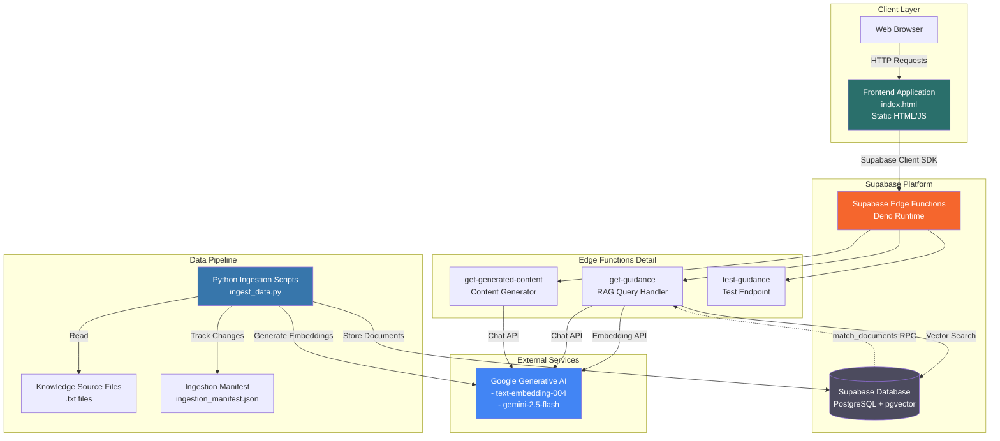
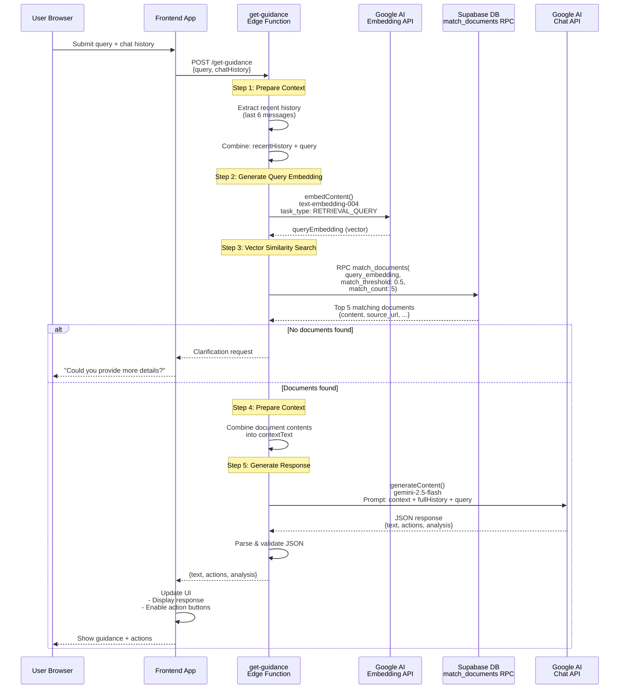
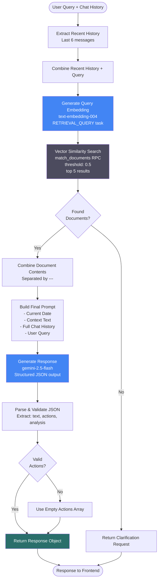
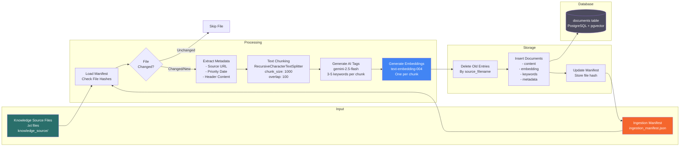
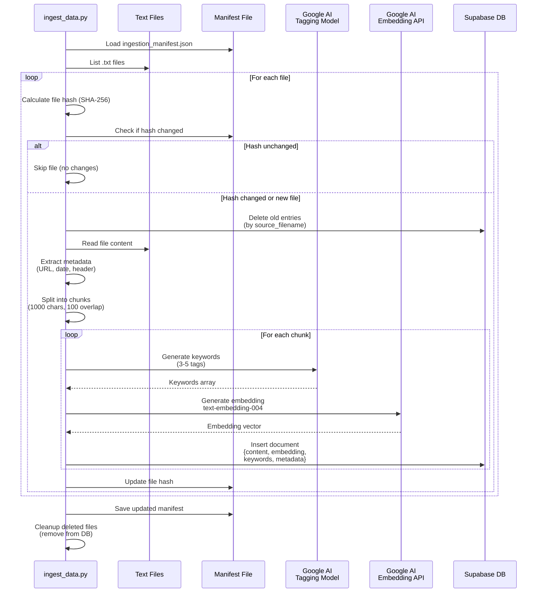

# The Tenant's Voice - Architecture Documentation

## Overview

The Tenant's Voice is a web application that provides AI-powered guidance to UK tenants on tenancy issues. The system uses a Retrieval-Augmented Generation (RAG) architecture to provide accurate, context-aware responses based on official sources like Shelter, Citizens Advice, and gov.uk.

## Table of Contents

1. [Macro-Level Architecture](#macro-level-architecture)
2. [Micro-Level RAG Flow](#micro-level-rag-flow)
3. [Data Ingestion Pipeline](#data-ingestion-pipeline)
4. [Component Details](#component-details)
5. [Data Flow](#data-flow)

---

## Macro-Level Architecture

The system consists of five main components that interact to provide tenant guidance:

### System Components

1. **Frontend Application**: Static HTML/JavaScript client served to users
2. **Supabase Edge Functions**: Serverless Deno functions handling business logic
3. **Supabase Database**: PostgreSQL with pgvector for vector similarity search
4. **Google Generative AI**: External API for embeddings and LLM generation
5. **Data Ingestion Pipeline**: Python scripts for processing knowledge base documents

### Macro Architecture Diagram



### System Interactions

1. **User Request Flow**:
   - User interacts with frontend in browser
   - Frontend calls Supabase Edge Functions via Supabase client SDK
   - Edge functions process requests and interact with database/external APIs
   - Responses returned to frontend and displayed to user

2. **Data Ingestion Flow**:
   - Python scripts process text files from knowledge source
   - Scripts generate embeddings via Google AI API
   - Processed documents stored in Supabase database
   - Manifest file tracks processed files to avoid re-processing

---

## Micro-Level RAG Flow

The RAG (Retrieval-Augmented Generation) system is the core of the application, enabling context-aware responses based on the knowledge base.

### RAG Query Processing Flow



### Detailed RAG Component Flow



### Key RAG Implementation Details

1. **Context Window Optimization**:
   - Recent history (last 6 messages) used for embedding generation
   - Full history used for final LLM generation
   - Reduces embedding API costs while maintaining conversation context

2. **Vector Search Parameters**:
   - Similarity threshold: 0.5 (cosine similarity)
   - Top K results: 5 documents
   - Uses pgvector's cosine distance for similarity

3. **Response Structure**:
   - `text`: Main guidance response
   - `actions`: Array of enabled action keys (e.g., "email_landlord")
   - `analysis.confidence`: High/Medium/Low confidence level

---

## Data Ingestion Pipeline

The data ingestion pipeline processes knowledge base documents, generates embeddings, and stores them in the database for RAG retrieval.

### Ingestion Pipeline Flow



### Ingestion Process Sequence



### Ingestion Key Features

1. **Change Detection**:
   - SHA-256 file hashing to detect changes
   - Manifest file tracks processed files
   - Only changed/new files are processed

2. **Text Processing**:
   - Chunk size: 1000 characters
   - Overlap: 100 characters (maintains context)
   - Metadata extraction from file headers

3. **AI-Enhanced Indexing**:
   - AI-generated keywords for each chunk
   - Vector embeddings for semantic search
   - Both stored in database for hybrid search capability

4. **Data Management**:
   - Old entries deleted before re-processing
   - Source filename tracking for updates
   - Automatic cleanup of deleted files

---

## Component Details

### Frontend Application (`index.html`)

**Technology**: Static HTML, JavaScript (ES6 modules), Tailwind CSS

**Key Features**:
- Chat interface for user queries
- Action buttons (email templates, guides, etc.)
- Postcode lookup for council information
- Local storage for chat history persistence
- Theme switching (light/dark mode)

**Supabase Integration**:
- Uses Supabase client SDK (`@supabase/supabase-js`)
- Calls edge functions via `supabase.functions.invoke()`
- Handles authentication via anon key

### Edge Functions

#### get-guidance (`supabase/functions/get-guidance/index.ts`)

**Purpose**: Main RAG query handler

**Process**:
1. Receives user query and chat history
2. Generates query embedding using recent context
3. Performs vector similarity search
4. Retrieves top 5 relevant documents
5. Generates response using LLM with retrieved context
6. Returns structured JSON with text, actions, and confidence

**Models Used**:
- `text-embedding-004`: Query embedding generation
- `gemini-2.5-flash`: Final response generation

**Response Format**:
```typescript
{
  text: string;           // Main guidance response
  actions: string[];      // Enabled action keys
  analysis: {
    confidence: "High" | "Medium" | "Low"
  }
}
```

#### get-generated-content (`supabase/functions/get-generated-content/index.ts`)

**Purpose**: Generate action-specific content (emails, guides, etc.)

**Process**:
1. Receives action key and chat history
2. Maps action key to description
3. Generates content using LLM with conversation context
4. Returns generated text

**Supported Actions**:
- `email_landlord`: Draft email to landlord
- `dispute_message`: Draft dispute message
- `step_by_step_guide`: Create step-by-step guide
- `email_council`: Draft email to council
- `call_council`: Create call talking points

**Model Used**:
- `gemini-2.5-flash`: Content generation

#### test-guidance (`supabase/functions/test-guidance/index.ts`)

**Purpose**: Simple test endpoint for connectivity

**Response**: Hardcoded JSON response for testing

### Supabase Database

**Technology**: PostgreSQL with pgvector extension

**Schema**:

**documents table**:
```sql
- id: uuid (primary key)
- content: text (document chunk content)
- embedding: vector(768) (text-embedding-004 embedding)
- keywords: text[] (AI-generated keywords)
- source_url: text (original source URL)
- priority_date: date (document date for prioritization)
- source_filename: text (original filename)
- created_at: timestamp
```

**match_documents RPC Function**:
```sql
match_documents(
  query_embedding: vector(768),
  match_threshold: float,
  match_count: int,
  p_keywords: text[]
) RETURNS TABLE(...)
```

Performs cosine similarity search using pgvector, optionally filtering by keywords.

### Data Ingestion Scripts

#### ingest_data.py

**Dependencies**:
- `supabase`: Supabase Python client
- `langchain`: Text splitting utilities
- `google-generativeai`: Google AI SDK
- `python-dotenv`: Environment variable management

**Process Flow**:
1. Loads ingestion manifest (tracks processed files)
2. Scans `knowledge_source/` directory for `.txt` files
3. For each file:
   - Calculates SHA-256 hash
   - Compares with manifest (skip if unchanged)
   - Extracts metadata from file header
   - Splits content into chunks
   - Generates AI tags and embeddings
   - Deletes old entries and inserts new ones
   - Updates manifest with new hash
4. Cleans up deleted files from database

**Configuration**:
- Chunk size: 1000 characters
- Chunk overlap: 100 characters
- Embedding model: `text-embedding-004`
- Tagging model: `gemini-2.5-flash`

#### clean_data.py

**Purpose**: Pre-processing script for cleaning scraped text

**Process**:
- Reads files from `input_files/`
- Uses Gemini to clean and format text
- Removes navigation elements, duplicates, artifacts
- Preserves original content and meaning
- Outputs cleaned files to `output_files/`

---

## Data Flow

### Query Flow (Runtime)

```
User Input
    ↓
Frontend (index.html)
    ↓ (HTTP POST)
Supabase Edge Function (get-guidance)
    ↓
1. Generate Query Embedding (Google AI)
    ↓
2. Vector Search (Supabase DB)
    ↓
3. Retrieve Top 5 Documents
    ↓
4. Generate Response (Google AI)
    ↓
5. Return JSON Response
    ↓
Frontend (Display + Enable Actions)
    ↓
User Sees Guidance
```

### Content Generation Flow

```
User Clicks Action Button
    ↓
Frontend (index.html)
    ↓ (HTTP POST)
Supabase Edge Function (get-generated-content)
    ↓
1. Map Action Key to Description
    ↓
2. Generate Content (Google AI)
    ↓
3. Return Generated Text
    ↓
Frontend (Display in Modal)
    ↓
User Copies/Edits Content
```

### Data Ingestion Flow (Offline)

```
Text Files (knowledge_source/)
    ↓
Python Script (ingest_data.py)
    ↓
1. Check Manifest (Hash Comparison)
    ↓
2. Extract Metadata & Content
    ↓
3. Split into Chunks
    ↓
4. Generate Tags (Google AI)
    ↓
5. Generate Embeddings (Google AI)
    ↓
6. Store in Supabase DB
    ↓
7. Update Manifest
```

---

## Technology Stack

### Frontend
- **HTML5/CSS3**: Static site structure
- **JavaScript (ES6 Modules)**: Client-side logic
- **Tailwind CSS**: Styling framework
- **Supabase JS SDK**: Backend integration

### Backend
- **Supabase Edge Functions**: Serverless Deno runtime
- **TypeScript**: Edge function language
- **PostgreSQL**: Database
- **pgvector**: Vector similarity search extension

### AI/ML
- **Google Generative AI**: 
  - `text-embedding-004`: Embedding generation
  - `gemini-2.5-flash`: Chat and content generation

### Data Processing
- **Python 3**: Ingestion scripts
- **LangChain**: Text splitting utilities
- **Google Generative AI SDK**: Python client

---

## Security Considerations

1. **API Keys**: Stored as environment variables in Supabase
2. **CORS**: Configured for cross-origin requests
3. **Authentication**: Uses Supabase anon key (public access)
4. **Input Sanitization**: JSON sanitization in edge functions
5. **Error Handling**: Graceful error responses to prevent information leakage

---

## Performance Optimizations

1. **Context Window Management**: 
   - Recent history for embeddings (reduces API costs)
   - Full history for final generation (maintains context)

2. **Vector Search**:
   - Indexed embeddings for fast similarity search
   - Threshold filtering to reduce irrelevant results

3. **Caching**:
   - Local storage for chat history
   - Manifest-based change detection (avoids re-processing)

4. **Response Parsing**:
   - Robust JSON parsing with fallback error handling
   - Prevents crashes from malformed AI responses

---

## Future Enhancements

Potential improvements to consider:

1. **Hybrid Search**: Combine vector search with keyword filtering
2. **Response Streaming**: Stream responses for better UX
3. **Multi-modal Support**: Handle images/documents from users
4. **Analytics**: Track query patterns and response quality
5. **A/B Testing**: Test different embedding models or prompts
6. **Rate Limiting**: Implement per-user rate limits
7. **Response Caching**: Cache common queries to reduce API costs

---

## Maintenance Notes

### Updating Knowledge Base

1. Add new `.txt` files to `knowledge_source/` directory
2. Run `python ingest_data.py`
3. Script automatically detects new/changed files
4. Manifest tracks processed files

### Monitoring

- Check Supabase Edge Function logs for errors
- Monitor Google AI API usage and costs
- Review database query performance
- Track user feedback via help modal

---

*Last Updated: 2025*
*Architecture Version: 1.0*

